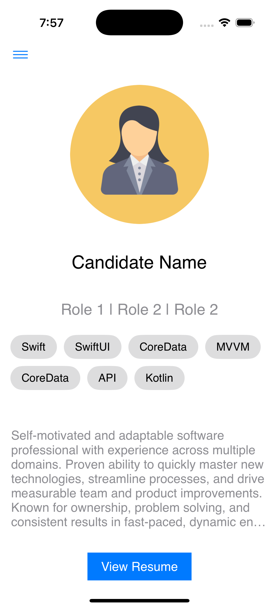
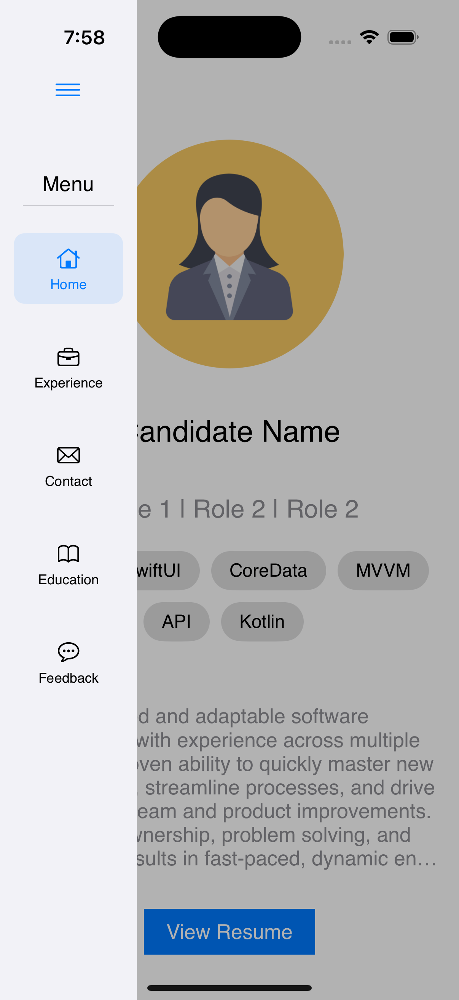
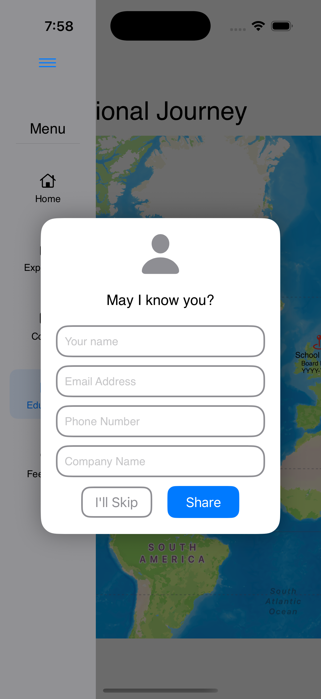
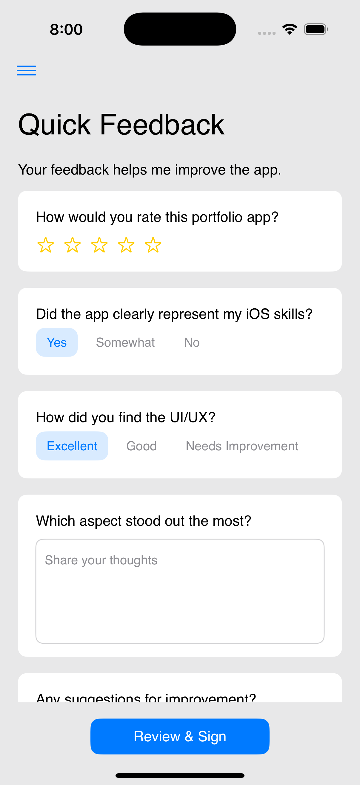
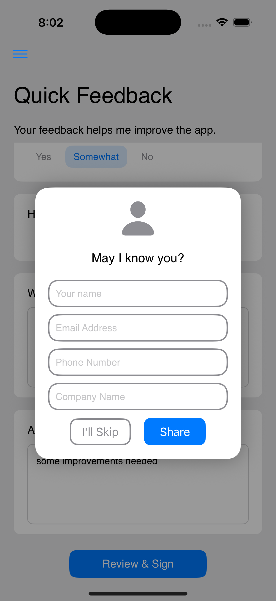
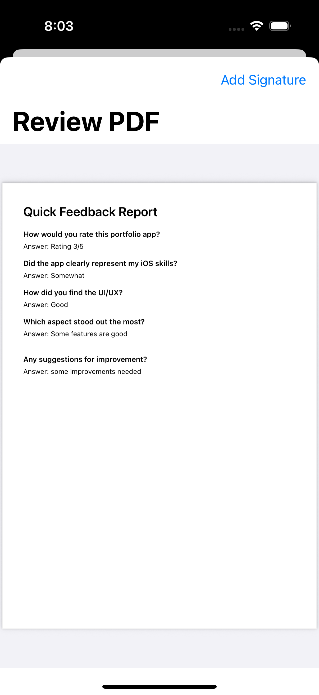

# 📱 MyPortfolio – iOS Portfolio App

MyPortfolio is a SwiftUI-based iOS application created to showcase my iOS development skills through an interactive, real-world style application.

The app focuses on clean architecture, thoughtful user experience, and scalable design, using sample data for demonstration purposes.

---

## ✨ Overview

The app allows users to:
- Explore profile and portfolio-related content
- Provide structured feedback
- Review and sign a generated feedback document
- Experience intelligent, non-intrusive user interaction flows

> Note: All data shown in the app is sample data. Backend integration is intentionally left for future enhancement.

---

## 📸 Screenshots

### Home / Profile Screen

---

### Tab Navigation

---

### First-Time Contact Prompt
The app intelligently asks for contact details only when the user first meaningfully interacts with the app.

---

### Feedback Questionnaire
Users can submit structured feedback through a guided questionnaire.

---

### Contact Prompt on Feedback Submission
If contact details were skipped initially, the app prompts the user again before final feedback submission.

---

### Feedback PDF Preview
Submitted feedback is compiled into a PDF document that the user can review.

---

### Digital Signature
Users can add a digital signature before completing feedback submission.

---

## 🧠 Key UX Decisions

- Contact details are requested only when necessary
- Users can skip contact input without blocking app usage
- Validation is contextual and non-intrusive
- Feedback flow ensures meaningful data collection without harming user experience

---

## 🏗️ Architecture

- SwiftUI
- MVVM Architecture
- Repository Pattern
- Core Data for local persistence
- Feature-based modular structure

---

## 🧪 Testing

- Repository-level unit tests included
- Focus on data correctness and business logic
- UI test scaffolding present

---

## 🚀 Future Enhancements

- Backend integration
- Authentication
- Cloud storage
- Android version using Jetpack Compose

---

## 🛠️ Requirements

- Xcode 15+
- iOS 17+
- Swift 5.9+

---

## 📂 Project Structure

